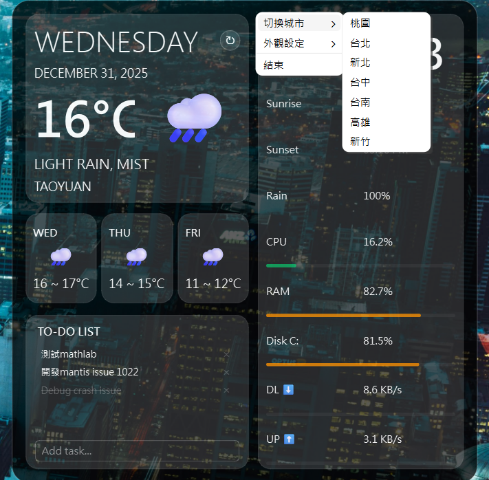
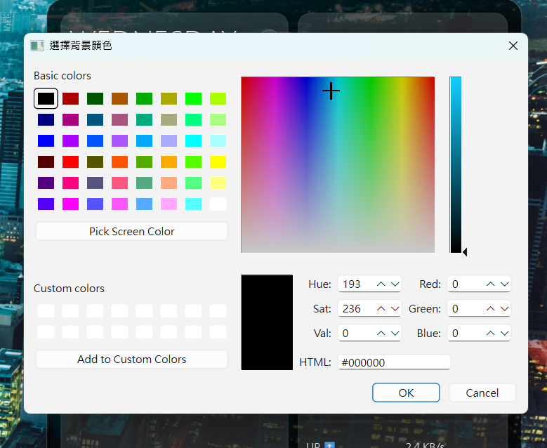

# Desktop Widget (時間 & 天氣)

這是一個使用 Python 與 PyQt6 開發的美觀桌面小工具。

## 功能特色
- **即時時間**：每秒精準更新。
- **即時天氣**：透過 `wttr.in` 獲取當前氣溫與天氣狀態。
- **玻璃擬態 (Glassmorphism)**：現代化的 UI 設計。
- **可調整透明度**：滑桿即時預覽。
- **風格切換**：支援暗色/亮色與毛玻璃質感。

### 技術實作分析
在專案啟動時，我們針對不同技術棧進行了評估，最終選擇 **Python (PyQt6)**，原因如下：

| 語言/框架 | 優缺點分析 | 為何選擇 PyQt6？ |
| :--- | :--- | :--- |
| **Python (PyQt/PySide)** | ✅ 開發快、API 串接簡單、系統資源存取直觀。<br>❌ 執行檔稍大。 | **最佳平衡點**：能快速實作天氣 API、系統監控與透明視窗，且開發迭代速度最快。 |
| **JavaScript (Electron)** | ✅ 介面極美、Web 技術通用。<br>❌ 記憶體佔用極高。 | 不適合作為常駐桌面的輕量 Widget，資源消耗過大。 |
| **C# (WinUI 3)** | ✅ 效能好、原生支援。<br>❌ 學習門檻較高。 | 開發週期較長，不如 Python 靈活。 |

## 預覽截圖 (Gallery)

<div align="center">
  
  <p><i>完整桌面效果 (Full Desktop)</i></p>
</div>

| 主畫面 (Main View) | 系統設定 (Settings) | 自定義顏色 (Custom Colors) |
| :---: | :---: | :---: |
|  |  |  |

## 安裝與執行

1. **建立虛擬環境**
   ```bash
   python -m venv venv
   ```

2. **啟動虛擬環境**
   ```bash
   # Windows
   .\venv\Scripts\activate
   ```

3. **安裝依賴**
   ```bash
   pip install PyQt6 requests
   ```

4. **執行程式**
   ```bash
   python main.py
   ```

## 開發工具
- **Python 3.x**
- **PyQt6**
- **Requests**
